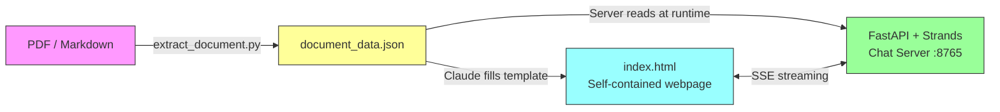
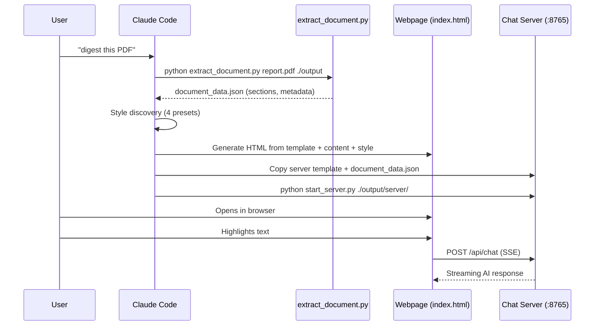
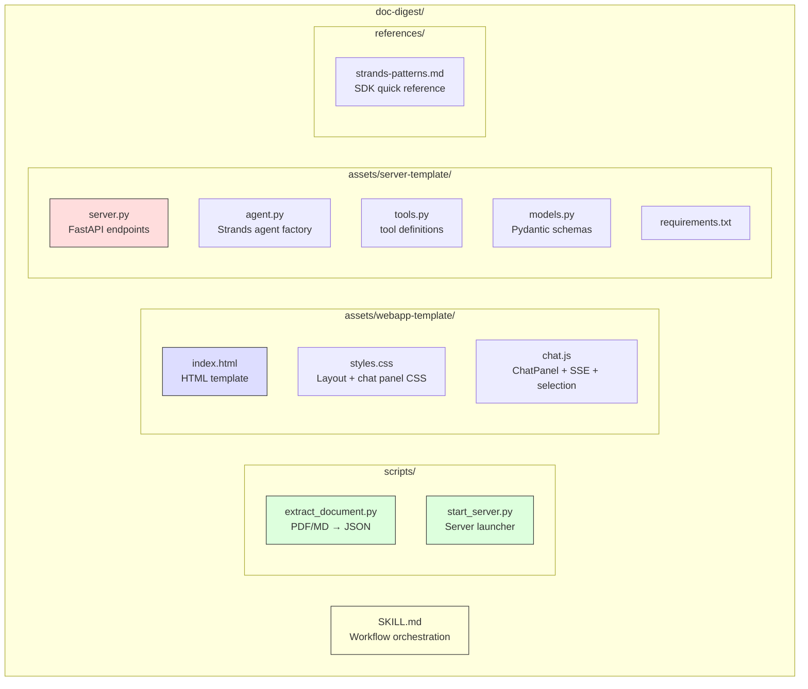

# doc-digest

Transform documents (PDF, markdown) into interactive, human-digestible webpages with AI-powered section-based chat.

<p align="center">
  <strong>Document in &rarr; Interactive webpage + AI chat out</strong>
</p>

```
"digest ~/reports/Q4-earnings.pdf"
```

## What It Does

doc-digest is a [Claude Code skill](https://docs.anthropic.com/en/docs/claude-code) that takes any PDF or markdown document and produces:

1. **A beautiful, self-contained HTML webpage** with table of contents, section navigation, and scroll-reveal animations
2. **An AI chat server** powered by [AWS Strands Agents SDK](https://github.com/strands-agents/sdk-python) for real-time Q&A about the document

The chat UI combines a **floating side panel** with **select-to-chat** — highlight any text to instantly ask about it, fact-check it, or get a summary.

## Architecture



### Data Flow



### Skill Structure



## Installation

### Prerequisites

- [Claude Code CLI](https://docs.anthropic.com/en/docs/claude-code) installed and configured
- Python 3.10+
- AWS credentials configured via `tokenmaster` profile (or set `AWS_PROFILE` env var)
- Access to Amazon Bedrock with Claude models enabled

### Install the Skill

**Option A: Clone directly into skills directory**

```bash
git clone git@github.com:NaichuanZhang/doc-digest-skill.git ~/.claude/skills/doc-digest
```

**Option B: From zip package**

```bash
# Download the release
unzip doc-digest.zip -d ~/.claude/skills/
```

**Option C: Manual copy**

```bash
# Copy the entire doc-digest/ folder to your skills directory
cp -r doc-digest ~/.claude/skills/doc-digest
```

The skill is automatically detected by Claude Code once it's in `~/.claude/skills/`.

### Verify Installation

Start a new Claude Code session and check that the skill appears:

```
> /skills
# Should list: doc-digest
```

Or simply ask Claude:

```
> digest ~/Desktop/report.pdf
```

## Usage

### Basic

Just tell Claude Code to digest a document:

```
digest ~/Desktop/NVCPitchDeckTemplate.pdf
```

```
make this report readable: ~/projects/research-paper.md
```

```
create an interactive viewer for ~/docs/technical-spec.pdf
```

### What Happens

Claude runs through 5 phases automatically:

| Phase | What | You Do |
|-------|------|--------|
| **0. Detect** | Identifies file type (PDF/markdown) | Nothing |
| **1. Process** | Extracts sections via `extract_document.py` | Confirm section list |
| **2. Style** | Presents 4 visual presets | Pick a style |
| **3. Generate** | Creates self-contained `index.html` | Opens automatically |
| **4. Chat Server** | Starts FastAPI + Strands on `:8765` | Chat away |

### Interacting with the Webpage

| Action | How |
|--------|-----|
| **Navigate sections** | Click sidebar ToC links or scroll |
| **Open chat** | Click the chat bubble (bottom-right) |
| **Ask about text** | Select text → click "Ask" in popup |
| **Fact-check** | Select a claim → click "Fact check" |
| **Summarize** | Select text → click "Summarize" |
| **Follow-ups** | AI generates probing questions per section |

## Style Presets

| Preset | Fonts | Theme | Best For |
|--------|-------|-------|----------|
| **Research Paper** | Fraunces + Work Sans | Cream, burgundy accent | Academic papers, studies |
| **Technical Report** | IBM Plex Mono + IBM Plex Sans | Dark (#1a1a2e), cyan accent | Specs, architecture docs |
| **Executive Brief** | Clash Display + Satoshi | White, electric blue | Pitch decks, summaries |
| **Magazine Feature** | Playfair Display + Source Sans 3 | Off-white, coral accent | Reports, editorials |

## Chat Server API

The chat server is document-agnostic — it reads `document_data.json` at runtime.

| Endpoint | Method | Description |
|----------|--------|-------------|
| `/api/health` | GET | Status + document title |
| `/api/sections` | GET | Section metadata (id, title, level, word_count) |
| `/api/chat` | POST | SSE streaming chat with section context |
| `/api/followups` | POST | Generate follow-up questions for a section |

### Chat Request

```json
{
  "message": "What does this section claim about market size?",
  "section_id": "market-size",
  "session_id": "uuid-here",
  "conversation_history": [
    { "role": "user", "content": "previous question" },
    { "role": "assistant", "content": "previous answer" }
  ]
}
```

### SSE Event Types

```
data: {"type": "start", "session_id": "..."}
data: {"type": "text", "content": "The document states..."}
data: {"type": "tool_call", "tool": "search_document"}
data: {"type": "done", "session_id": "..."}
```

## Configuration

### Environment Variables

| Variable | Default | Description |
|----------|---------|-------------|
| `AWS_PROFILE` | `tokenmaster` | AWS credentials profile for Bedrock |
| `AWS_REGION` | `us-west-2` | AWS region |
| `BEDROCK_MODEL_ID` | `us.anthropic.claude-sonnet-4-6-20250514-v1:0` | Model for chat agent |

### Agent Tools

The Strands agent has 3 tools available:

| Tool | Purpose |
|------|---------|
| `search_document(query)` | Full-text search across all sections |
| `get_section(section_id)` | Retrieve a specific section's content |
| `fact_check(claim, section_id?)` | Verify a claim against document content |

## Document Data Schema

The intermediate `document_data.json` format:

```json
{
  "metadata": {
    "title": "Pitch Deck Example",
    "author": "Jane Doe",
    "date": "2024-01-15",
    "page_count": 16,
    "source_type": "pdf",
    "source_file": "pitch-deck.pdf"
  },
  "sections": [
    {
      "id": "executive-summary",
      "title": "Executive Summary",
      "level": 2,
      "content": "## Executive Summary\n\nThe markdown content...",
      "page_start": null,
      "word_count": 150
    }
  ],
  "full_text": "Complete document text in markdown..."
}
```

## Supported Formats

| Format | Extension | Extraction Method |
|--------|-----------|-------------------|
| PDF | `.pdf` | [pymupdf4llm](https://pypi.org/project/pymupdf4llm/) (OCR + structure) |
| Markdown | `.md`, `.markdown` | Native heading parser |

## Development

### Running the extraction script standalone

```bash
pip install pymupdf4llm pyyaml
python scripts/extract_document.py ~/Desktop/report.pdf ./output/
cat ./output/document_data.json | python -m json.tool
```

### Running the chat server standalone

```bash
cd output/server/
pip install -r requirements.txt
python server.py
# → http://localhost:8765
curl http://localhost:8765/api/health
curl http://localhost:8765/api/sections
```

### Customizing the webpage

Edit `:root` CSS variables in the generated `index.html`:

```css
:root {
  --bg-primary: #faf9f7;
  --accent: #c41e3a;
  --font-display: 'Fraunces', serif;
  --font-body: 'Work Sans', sans-serif;
}
```

## License

MIT
